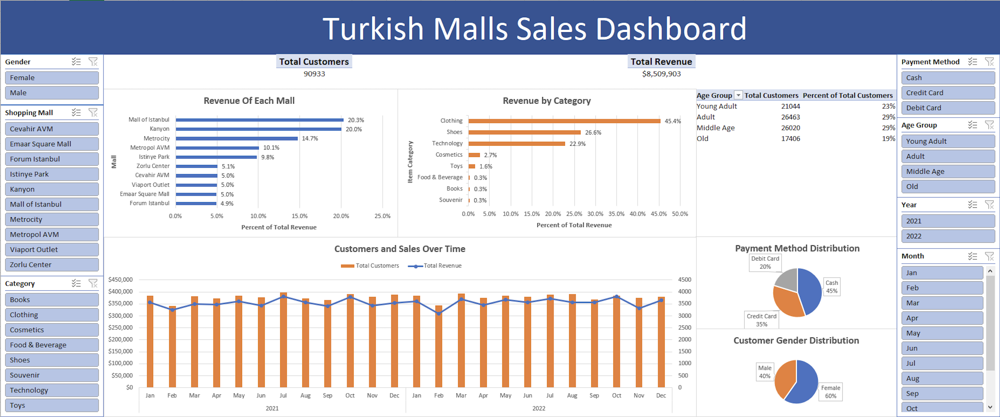

# Mall Sales Excel Dashboard

I wanted to create a sales dashboard in Excel for fun. I went on Kaggle and found a CSV dataset on sales data on a series of malls in Istanbul, Turkey.

Link to Original Dataset: [Click Here](https://www.kaggle.com/datasets/mehmettahiraslan/customer-shopping-dataset)

## Approach

- Formatted dates and filtered out rows of unnecessary data from the dataset using Pandas in a Jupyter Notebook
- Imported the CSV dataset with formatted dates to Excel and transformed it into an Excel sheet
- Performed further data cleaning in Excel by checking for duplicate rows and null/outlier values for each column
- Feature engineered new columns of data like age group, revenue, dollars in USD using existing columns
- Created pivot tables and pivot charts using the finalized Excel sheet
- Created the dashboard by piecing together pivot charts/tables and used slicers for interactive filtering

## Files in this Repo

- customer_shopping_data.csv: The original CSV dataset downloaded from Kaggle
- formatting_shopping_mall_dates.ipynb: code for formatting dates in customer_shopping_data.csv as well as filtering out certain rows
- customer_data.csv: customer_shopping_data.csv with formatted dates and filtered data
- mall_sales_dashboard.xlsx: The excel workbook containing the customer_data.csv in an excel sheet with modifications, pivot tables, pivot charts and the dashboard 
